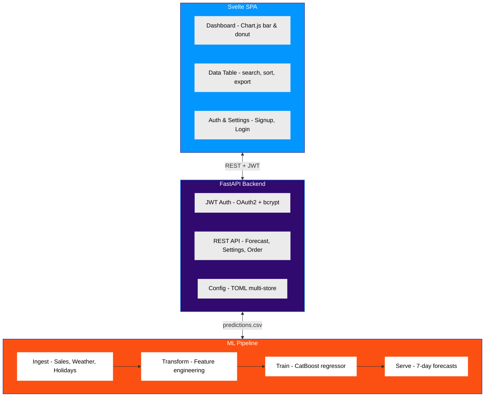

# Foodsight — ML-Powered Bakery Sales Prediction

## Challenge

German artisan bakeries face a daily balancing act: overstock means waste (average 10-15% of baked goods are discarded), while understock means lost revenue and unhappy customers. Traditional ordering relies on gut feeling and rule-of-thumb multipliers, leading to systematic inefficiency across the industry.

Foodsight was conceived as a SaaS tool to replace guesswork with data-driven demand forecasting — predicting exactly how much of each product a bakery should order for tomorrow, the day after, and the coming week.

## Our Approach

**End-to-end ML pipeline with a production-ready SaaS frontend.**

The system follows a layered architecture:

1. **Data Ingestion** — Automated ETL pipeline pulls POS sales data (via ready2order API plugin) and weather forecasts (Open-Meteo API), normalizes them into a staged data lake (raw → transformed → training-ready).

2. **Feature Engineering** — Temporal features (weekday, holidays, school breaks via `holidays` library), weather features (temperature, precipitation), and lag features are computed using `tsfresh` and `featuretools`. The pipeline is plugin-based: new POS systems can be integrated by adding a plugin module.

3. **Model Training** — A CatBoost gradient-boosted regressor handles categorical features natively (product names, store IDs, weather codes) without one-hot encoding. The model is retrained twice daily on a schedule.

4. **Prediction Serving** — The trained model generates 7-day forecasts per store and product, computing order ranges (min/optimal/max) that balance waste risk against stockout risk.

5. **Web Dashboard** — A Svelte 3 SPA with Material Design (SMUI) presents forecasts as interactive bar charts and donut visualizations. Baker staff can adjust order quantities directly in the table and export orders as Excel/CSV.

6. **API Layer** — FastAPI serves JWT-authenticated REST endpoints for forecasts, user settings, order export, and user registration. Multi-store support allows bakery chains to manage multiple locations from one account.

**Key technical decisions:**
- **CatBoost over XGBoost/LightGBM**: Native categorical feature handling eliminates the encoding step and produces better results on mixed-type data.
- **TOML for configuration**: Human-readable, supports nested tables for multi-store setups, easy to edit without a database.
- **Plugin architecture for POS systems**: New cash-register integrations require only a single Python module.
- **Jupyter-paired pipeline scripts**: Each pipeline step has a `.py` file (for production) paired with a `.ipynb` (for exploration) via jupytext.

## Results & Impact

- **Working prototype** deployed and demonstrated to potential bakery partners in the Wiesbaden/Mainz area
- **Multi-store capability** tested with 3 pilot locations
- **Full-stack SaaS architecture** operational: CI/CD-ready, Dockerized, deployed to Hetzner VPS with Traefik + Let's Encrypt
- **Modernized codebase** upgraded from Python 3.7 → 3.12 with Pydantic v2, achieving a clean, portfolio-ready codebase

## Visual Assets

**Live demo:** https://foodsight.jonaskrauss.de/ (login: `demo` / `demo123`)

**Dashboard with charts:**
- Bar chart: Sales forecast comparison (tomorrow vs. day after) by product
- Donut chart: Order range distribution (minimum vs. safety buffer)
- Summary cards: Total forecast volume, product count, prediction horizon
- Interactive data table with search, sort, and order export

**Architecture diagram:**

## Tech Stack

**Backend:**
- Python 3.12, FastAPI, uvicorn, Pandas, Pydantic v2
- JWT authentication (python-jose), bcrypt password hashing
- TOML-based multi-store configuration

**Frontend:**
- Svelte 3, SMUI (Material Design), Tailwind CSS
- Chart.js (bar + doughnut charts)
- Rollup bundler

**ML/Data:**
- CatBoost (gradient boosting), scikit-learn
- tsfresh, featuretools (time-series feature engineering)
- holidays library (German holiday calendar)

**Infrastructure:**
- Docker, Traefik reverse proxy, Let's Encrypt SSL
- Hetzner Cloud VPS (staging), OpenTofu IaC
- GitHub Actions CI/CD

**Data Sources:**
- POS sales data (ready2order API plugin)
- Weather forecasts (Open-Meteo API)
- German holiday/school break calendars

## Additional Context

- **Timeline:** Initial development ~3 months (2021), modernization and portfolio prep July 2026
- **Team:** 2 developers (backend/ML + frontend), 1 co-founder (business/domain)
- **My role:** Full-stack development, ML pipeline architecture, API design, deployment infrastructure
- **Status:** Portfolio demo — fully functional prototype, deployed to staging with demo data
- **Source:** [github.com/jkrauss/foodsight-backend](https://github.com/jkrauss/foodsight-backend)

---

*Built by [Jonas Krauss](https://jonaskrauss.de) · [LinkedIn](https://www.linkedin.com/in/kraussjonas/)*
